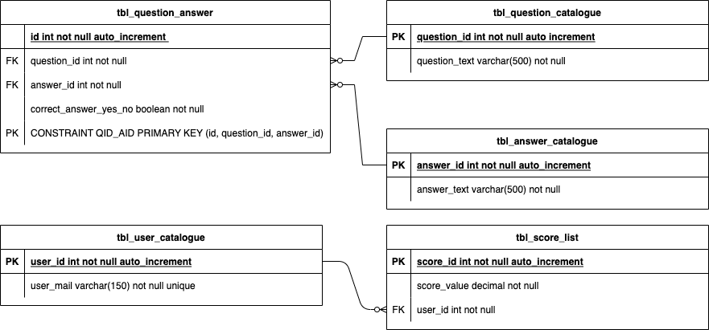

# NDSHF_SemArbeit_1
## Multiple-Choice Lern- und Prüfungsplattform 

Wir erstellen ein Tool mit dem Multiple-Choice Fragen in eine Datenbank abgefüllt und verwalltet werden kann.
Das Tool stellt die eingetragenen Fragen in zufälliger Reihenfolge und die Antworten werden auf ihre Richtigkeit
bearbeitet.

Das Tool wird zwei Ebenen besitzen Ebene 1 => Lernmodus Ebene 2 => Prüfungsmodus

### Lernmodus (Primärprojekt)

Im Lernmodus soll die Antwort direkt auf ihre Richtigkeit geprüft werden und die Lösung zur Frage wird direkt
innerhalb der View mit Verweis auf die Referenzlösung dargestellt.

### Prüfungsmodus (Optionalprojekt)

Im Prüfungsmodus werden die Antworten erst am Ende auf Richtigkeit geprüft und es wird berechnet wieviele Prozent
der Prüfling korrekt beantwortet hat

<table>
<tr>
<td>

### Start GUI Struktur
- Titel der Mainview
- Button für Lernmodus
- Button für Fragenverwaltung
</td>
<td>

### Lernmodus GUI Struktur
- Titel für die Lernview
- ChoiceBox oder InputField für Anzahl Fragen 
- Label mit max. Anzahl Fragen möglich 
- Startbutton
</td>
<td>

### Lernmodus aktiv GUI Struktur
- Titel mit Frage
- Antwortoptionen per CheckBox
- Hinweistext zu Lösung (Grün/Rot)
- Button für Check/Next
</td>
</tr>
<tr>
<td>

### Endview GUI Struktur

- Titel der Endview
- Button mit Ende
- Statisik der Max. und erreichten Punktz
- Textfeld für Name
- Anzeige der letzten 10 Lerndurchgänge
- Button Zurück/Home
- Button Exit
</td>
<td>

### Verwaltungsmaske GUI Struktur
- Titel für View
- Fragen/Antworten hinzufügen
- Fragen/Antworten bearbeiten
- Fragen/Antworten löschen
- Highscore Tabelle zurücksetzen
</td>
<td>

#### GUI für Fragen/Antworten hinzufügen
- Titel
- Textfeld für Frage
- Button für Antwort hinzufügen/Max. 4 Antworten möglich
- Textfeld für AntwortAuswahlfeld für Richtig/Falsch
- Button für weitere Frage hinzufügen
- Button für Speichern
</td>
</tr>
<tr>
<td>

#### GUI für Fragen/Antworten bearbeiten
- Titel
- Ausgabefeld der Frage
- Ausgabefeld der Antworten
- Auswahlfeld für TRUE/FALSE
- Button für Speichern
</td>
<td></td>
<td></td>
</tr>
</table>

